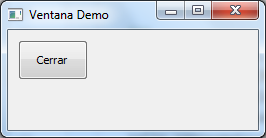

hola_pyqt.pyw
=============

Para ejecutar esta aplicación se puede usar el interpretador pythonw para que
no aparezca una ventana de consola cuando se ejecuta una aplicación Python GUI.

**Windows**: path_to_python\pythonw.exe .\hola_pyqt.pyw

## Resultado

