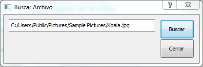

Buscar Archivo
=============

Esta aplicación muestra un botón de pulsación con el texto 'Buscar'. Cuando se
hace click en Buscar, la aplicación abre el gestor de archivos nativo del
sistema. Una vez seleccionado el archivo, el programa copia la ruta del archivo
a un cuadro de texto.

Resultado
---------

